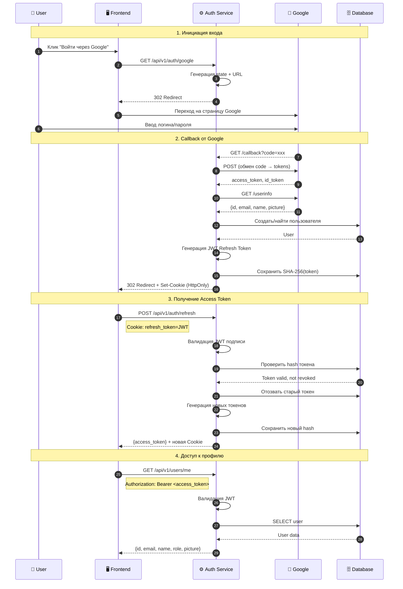

# 🔐 Auth Service

> 🔗 Микросервис для **Интернет-магазина электроники**. Главный репозиторий: TODO

## 🛠️ Tech Stack

<table>
  <tr>
    <td align="center" width="96">
      
      <br>Python 3.12
    </td>
    <td align="center" width="96">
      
      <br>FastAPI
    </td>
    <td align="center" width="96">
      
      <br>PostgreSQL
    </td>
    <td align="center" width="96">
      
      <br>SQLAlchemy
    </td>
    <td align="center" width="96">
      
      <br>Docker
    </td>
    <td align="center" width="96">
      
      <br>OAuth 2.0
    </td>
    <td align="center" width="96">
      
      <br>JWT
    </td>
    <td align="center" width="96">
      
      <br>pytest
    </td>
  </tr>
</table>

## 🎯 Описание

Микросервис аутентификации. Обеспечивает вход через Google OAuth 2.0, управление JWT-токенами и профилями пользователей.

### 🔐 Аутентификация
- **Google OAuth 2.0** — безопасный вход через Google
- **Автоматическая регистрация** — создание профиля при первом входе
- **State parameter** — защита от CSRF-атак

### 🎫 JWT Токены
- **Access Token** — короткоживущий (15 мин), для авторизации запросов
- **Refresh Token** — долгоживущий (30 дней), для обновления сессии
- **Ротация токенов** — новый refresh при каждом обновлении

### 🛡️ Безопасность
- **SHA-256 хеширование** — refresh токены хранятся в БД в виде хешей
- **HttpOnly Cookie** — защита от XSS-атак
- **Secure + SameSite** — защита от CSRF
- **Отзыв токенов** — logout и logout-all функции

### 👤 Управление пользователями
- **Профиль** — получение и обновление данных
- **Роли** — guest, user, admin
- **Аватар** — URL фото из Google или кастомный


### 📊 Логирование
- **structlog** — структурированные логи
- **Request ID** — трекинг запросов
- **JSON/Console** — dev/prod форматы


### Google OAuth 2.0 Flow



## 📁 Структура проекта

```
auth-service/
├── .dockerignore           
├── .env.example            # Пример переменных окружения
├── .gitignore
├── .pre-commit-config.yaml 
├── alembic.ini             
├── alembic/                # Миграции БД
│   ├── versions/
│   │   └── ...             
│   ├── env.py
│   └── script.py.mako
├── docker-compose.dev.yml  # Docker Compose для разработки
├── docker-compose.yml      # Основной Docker Compose
├── Dockerfile              
├── pyproject.toml          
├── requirements.txt        
└── src/
    ├── api/
    │   ├── v1/
    │   │   ├── auth.py         
    │   │   ├── users.py        
    │   │   └── router.py       
    │   ├── internal/           # межсервисное взаимодействие
    │   │   ├── users.py        
    │   │   └── router.py       
    │   └── dependencies.py    
    ├── db/
    │   ├── database.py         # Настройка БД (SQLAlchemy)
    │   └── models.py           # Модели базы данных
    ├── middleware/
    │   └── request_logger.py   # Middleware логирования
    ├── repositories/           # Работа с БД 
    │   ├── refresh_token.py
    │   └── user.py
    ├── schemas/                # Pydantic схемы (DTO)
    │   ├── client.py
    │   ├── oauth.py
    │   └── user.py
    ├── security/               # Безопасность
    │   ├── jwt_service.py      # Работа с JWT
    │   └── oauth.py            # OAuth клиент
    ├── services/               # Бизнес-логика
    │   ├── auth.py
    │   └── user.py
    ├── config.py               # Конфигурация (pydantic-settings)
    ├── constants.py            # Константы
    ├── exceptions.py           # Кастомные ошибки
    ├── logger.py               # Настройка structlog
    └── main.py                 # Точка входа приложения
```

## 🗄️ База данных

### 👤 Users
- **id** — (UUID)
- **email** — почта из Google аккаунта
- **name** — (по умолчанию из Google)
- **picture_url** — ссылка на аватар (из Google)
- **role** — роль пользователя (`user`, `admin`)
- **google_id** — уникальный идентификатор в системе Google
- **is_active** — флаг активности аккаунта
- **created_at** — дата и время создания профиля
- **updated_at** — дата и время последнего обновления профиля

### 🎫 Refresh Tokens
- **id** — (UUID)
- **token_hash** — хеш токена (SHA-256)
- **user_id** — (UUID) ID пользователя
- **user_agent** — информация об устройстве
- **ip_address** — IP адрес
- **is_revoked** — флаг отзыва
- **expires_at** — дата истечения
- **created_at** — дата создания

## 🔧 Конфигурация

Все переменные окружения описаны в файле [`.env.example`](.env.example).

### 🔑 Настройка Google OAuth 2.0

<details>
<summary>📋 Быстрая настройка</summary>

1. Откройте [Google Cloud Console](https://console.cloud.google.com/)
2. Создайте новый проект или выберите существующий
3. Перейдите в **APIs & Services → Credentials**
4. Нажмите **Create Credentials → OAuth client ID**
5. Если требуется, настройте **OAuth consent screen** (External, заполните название приложения)
6. Выберите тип **Web application**
7. Заполните поля:
   - **Authorized JavaScript origins**: `http://localhost:3000`
   - **Authorized redirect URIs**: `http://localhost:8001/api/v1/auth/google/callback`
8. Скопируйте **Client ID** и **Client Secret** в `.env`

</details>

> 📖 Подробнее: [Google OAuth 2.0 Documentation](https://developers.google.com/identity/protocols/oauth2)

## 📦 Установка и запуск

### Разработка

```bash
# Запуск PostgreSQL
docker-compose -f docker-compose.dev.yml up -d

# Миграции
alembic upgrade head

# Запуск
uvicorn src.main:app --reload --port 8001 --no-access-log
```

### Быстрый запуск

```bash
docker-compose up --build -d
```

### API Documentation

После запуска доступна документация:
- **Swagger UI**: http://localhost:8001/docs
- **ReDoc**: http://localhost:8001/redoc

## 🔌 API Endpoints

### Public API (через API Gateway)

| Метод | Путь | Описание | Auth |
|-------|------|----------|------|
| `GET` | `/api/v1/auth/google` | Инициация OAuth | ❌ |
| `GET` | `/api/v1/auth/google/callback` | Callback от Google | ❌ |
| `POST` | `/api/v1/auth/refresh` | Обновление токенов | 🍪 |
| `POST` | `/api/v1/auth/logout` | Выход (отзыв токена) | 🍪 |
| `POST` | `/api/v1/auth/logout-all` | Выход со всех устройств | 🔑 |
| `GET` | `/api/v1/users/me` | Получение профиля | 🔑 |
| `PATCH` | `/api/v1/users/me` | Обновление профиля | 🔑 |

**Легенда**: ❌ — без аутентификации, 🍪 — требуется Cookie, 🔑 — требуется Bearer Token

### Internal API (межсервисное взаимодействие)

| Метод | Путь | Описание | Используется в |
|-------|------|----------|----------------|
| `GET` | `/internal/users/{user_id}` | Получить данные пользователя | Cart Service, Order Service |
| `GET` | `/internal/users/{user_id}/exists` | Проверить существование пользователя | Cart Service, Order Service |